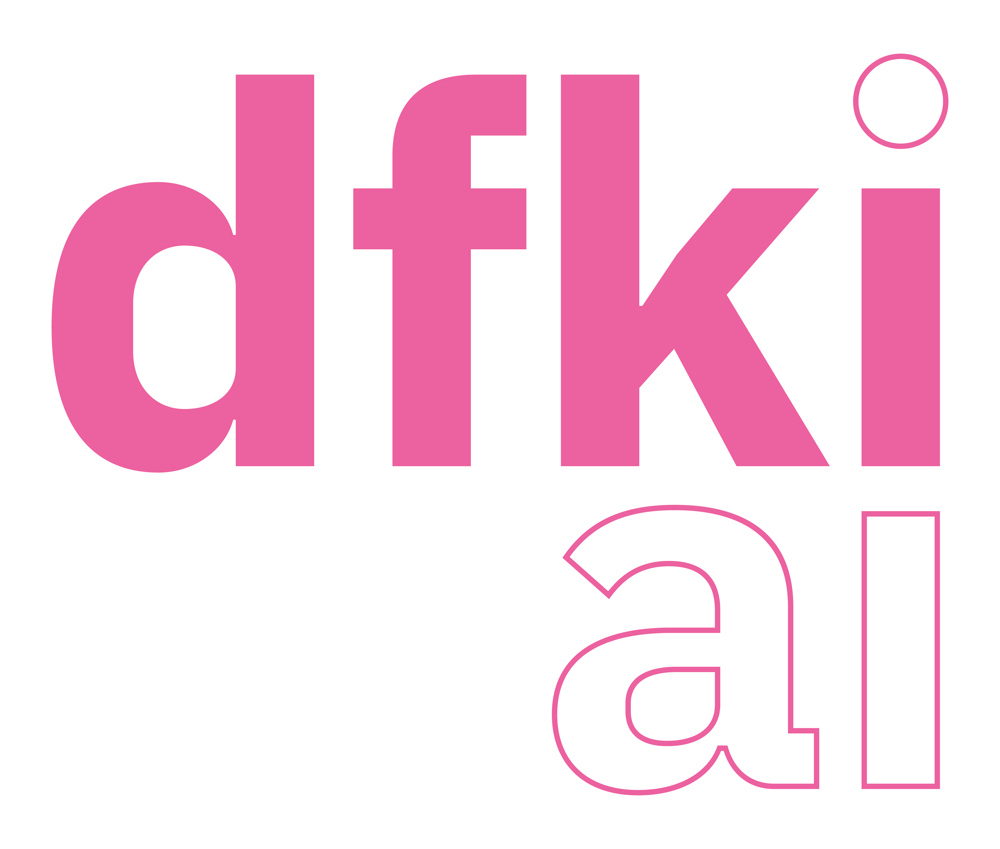
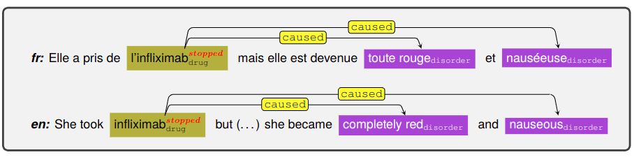
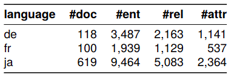

<div align="center">
  
&nbsp; &nbsp; &nbsp; &nbsp;
  
&nbsp; &nbsp; &nbsp; &nbsp;
  
&nbsp; &nbsp; &nbsp; &nbsp;
  
&nbsp; &nbsp; &nbsp; &nbsp;
  
</p>


**KEEPHA-ADR Baselines: Pharmaceutical Information Extraction Systems for French, German, and Japanese.**

------
<div align="left">


## Introduction

An adverse drug reaction (ADR) is a “harmful or unpleasant reaction, resulting from an intervention related to the use of a medicinal product” (Edwards and Aronson, 2000). Though clinical trials are conducted for every drug, the pool of trial participants can never represent the entire population. Thus, to actively monitor the effect of medical use, we built systems to extract online discussions about drug usage. The systems extract the following from a given piece of text.

<div align="center">

<div align="left">

- **Name Entity Recognition (NER)**:  identify l’infliximab as `drug`, toute rouge and nauséeuse as `disorder`.
- **Attribute Classification (AC)**:  classify the status of the drug l’infliximab as `stopped`.
- **Relation Extraction (RE)**:  realize `caused` relations between l’infliximab and toute rouge, between l’infliximab and nauséeuse.

Overall, the corpus contains annotations covering 12 entity types, 4 attribute types, and 13 relation types. The number of documents, the number of annotations for entities, relations, attributes per language:
<div align="center">

<div align="left">


## Getting started

```
pip install -r ./requirements.txt
```

**Data Access** If you are interested in the data, please contact Lisa Raithel (raithel@tu-berlin.de)
The dataset is to be extracted in the directory `./data`


## Example usage

To reproduce the results for the three Information Extraction tasks, you need a run file and a config file. 
You can find config files in the folder `./configs` for respective tasks.

**Name Entity Recognition (NER)**
```
python src/finetune_ner.py configs/ner_configs/CONFIG_TRAIN.json
python src/inference_ner.py configs/eval_ner_configs/CONFIG_TEST.json
```

**Attribute Classification (AC)**
```
python src/finetune_att.py configs/att_configs/CONFIG_TRAIN.json
python src/inference_att.py configs/eval_att_configs/CONFIG_TEST.json
```

**Relation Extraction (RE)**
```
python src/finetune_re.py configs/re_configs/CONFIG_TRAIN.json
python src/inference_re.py configs/eval_re_configs/CONFIG_TEST.json
```


## Evaluation

```
java -cp brateval.jar au.com.nicta.csp.brateval.CompareEntities EVAL_FOLDER REF_FOLDER false
```


## Citation

Please cite our paper if you plan to use `KEEPHA-ADR`:

```
@inproceedings{raithel_dataset_2024,
  title = {A {{Dataset}} for {{Pharmacovigilance}} in {{German}}, {{French}}, and {{Japanese}}: {{Annotating Adverse Drug Reactions}} across {{Languages}}},
  booktitle = {Proceedings of the {{Language Resources}} and {{Evaluation Conference}}},
  author = {Raithel*, Lisa and Yeh*, Hui-Syuan and Yada, Shuntaro and Grouin, Cyril and Lavergne, Thomas and N{\'e}v{\'e}ol, Aur{\'e}lie and Paroubek, Patrick and Thomas, Philippe and M{\"o}ller, Sebastian and Nishiyama, Tomohiro and Aramaki, Eiji and Matsumoto, Yuji and Roller, Roland and Zweigenbaum, Pierre},
  year = {2024},
  month = may,
  publisher = {{ European Language Resources Association}},
  address = {{Torino, Italy}},
  copyright = {All rights reserved}
}
```

